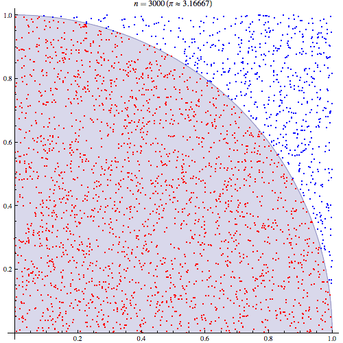

Examples
========

You can find the examples detailed on this page in the |exampleDirectory|_
directory of SCOOP.

.. |exampleDirectory| replace:: :file:`examples/`
.. _exampleDirectory: https://code.google.com/p/scoop/source/browse/examples/

Please check the :doc:`api` for any implentation detail of the proposed 
functions.

Introduction to the :meth:`~scoop.futures.map` function
-------------------------------------------------------

A core concept of task-based parallelism as presented in SCOOP is the
map. An introductory example to map working is presented in |mapDocFile|_.

.. |mapDocFile| replace:: :file:`examples/mapDoc.py`
.. _mapDocFile: https://code.google.com/p/scoop/source/browse/examples/mapDoc.py

.. literalinclude:: ../examples/mapDoc.py
   :lines: 21-
   :linenos:

Line `1` allows Python 2 users to have a print function compatible with
Python 3.

On line `2`, SCOOP is imported.

On line `4-5`, the function that will be mapped is declared.

The condition on line `7` is a safety barrier that prevents the main program to
be executed on every workers. It ensures that the map is issued only by one
worker, the root.

The :meth:`~scoop.futures.map` function is located on line `8`.
It launches the `helloWorld` function 16 times, each time with a different
argument value selected from the `range(16)` argument.
This method is compatible with the standard Python |map()|_ function and thus
can be seamlessly interchanged without modifying its arguments.

.. |map()| replace:: *map()*
.. _map(): http://docs.python.org/library/functions.html#map

The example then prints the return values of every calls on line `9`.

You can launch this program using :program:`python -m scoop`.
The output should look like this::

  ~/scoop/examples$ python -m scoop -n 8 mapDoc.py
  Hello World from Future #0
  Hello World from Future #1
  Hello World from Future #2
  [...]

.. note::
  Results of a map are always ordered even if their computation was made
  asynchronously on multiple computers.

.. note::
  You can toy around with the previous example by changing the second parameter
  of the :meth:`~scoop.futures.map` function. Is it working with string arrays,
  pure strings or other variable types?

Computation of :math:`\pi`
--------------------------

A `Monte-Carlo method <http://en.wikipedia.org/wiki/Monte_Carlo_method>`_ to 
calculate :math:`\pi` using SCOOP to parallelize its computation is found in 
|piCalcFile|_.
You should familiarize yourself with 
`Monte-Carlo methods <http://en.wikipedia.org/wiki/Monte_Carlo_method>`_ before
going forth with this example. 

    Image from `Wikipedia <http://en.wikipedia.org/wiki/Monte_Carlo_method>`_
    made by `CaitlinJo <http://commons.wikimedia.org/wiki/User:CaitlinJo>`_
    that shows the Monte Carlo computation of :math:`\pi`.

.. |piCalcFile| replace:: :file:`examples/piCalc.py`
.. _piCalcFile: https://code.google.com/p/scoop/source/browse/examples/piCalc.py

First, we need to import the needed functions as such:

.. literalinclude:: ../examples/piCalcDoc.py
   :lines: 22-24
   :linenos:

The `Monte-Carlo method <http://en.wikipedia.org/wiki/Monte_Carlo_method>`_ is
then defined. It spawns two pseudo-random numbers that are fed to the 
`hypot <http://docs.python.org/library/math.html#math.hypot>`_ function which 
calculates the hypotenuse of its parameters.
This step computes the 
`Pythagorean equation <http://en.wikipedia.org/wiki/Pythagorean_theorem>`_
(:math:`\sqrt{x^2+y^2}`) of the given parameters to find the distance from the 
origin (0,0) to the randomly placed point (which X and Y values were generated 
from the two pseudo-random values).
Then, the result is compared to one to evaluate if this point is inside or 
outside the `unit disk <http://en.wikipedia.org/wiki/Unit_disk>`_.
If it is inside (have a distance from the origin lesser than one), a value of 
one is produced (red dots in the figure), otherwise the value is zero (blue dots
in the figure).
The experiment is repeated ``tries`` number of times with new random values.

The function returns the number times a pseudo-randomly generated point fell
inside the `unit disk <http://en.wikipedia.org/wiki/Unit_disk>`_ for a given
number of tries.

.. TODO: don't restart line numbering

.. literalinclude:: ../examples/piCalcDoc.py
   :lines: 26-27
   :linenos:

One way to obtain a more precise result with a 
`Monte-Carlo method <http://en.wikipedia.org/wiki/Monte_Carlo_method>`_ is to
perform the method multiple times. The following function executes repeatedly
the previous function to gain more precision.
These calls are handled by SCOOP using it's :meth:`~scoop.futures.map` 
function.
The results, that is the number of times a random distribution over a 1x1 
square hits the `unit disk <http://en.wikipedia.org/wiki/Unit_disk>`_ over a 
given number of tries, are then summed and divided by the total of tries.
Since we only covered the upper right quadrant of the
`unit disk <http://en.wikipedia.org/wiki/Unit_disk>`_ because both parameters
are positive in a cartesian map, the result must be multiplied by 4 to get the 
relation between area and circumference, namely 
:math:`\pi`.

.. literalinclude:: ../examples/piCalcDoc.py
   :lines: 29-31
   :linenos:

As :ref:`previously stated <test-for-main-mandatory>`, you `must` wrap your
code with a test for the __main__ name.

.. literalinclude:: ../examples/piCalcDoc.py
   :lines: 33-34
   :linenos:

You can now run your code using the command :program:`python -m scoop`.

Residual sum of squares
-----------------------

You can use the Residual Sum of Squares (RSS) metric to verify if two signals
are similar to one another.

The RSS is defined by the mathematical equation
:math:`RSS = \sum_{i=1}^n (y_i - x_i)^2`.
Put it simply, you take the difference between every element of your arrays,
square each of these results and then sum it.

Its implementation is found in |rssDocFile|_:

.. |rssDocFile| replace:: :file:`examples/rssDoc.py`
.. _rssDocFile: https://code.google.com/p/scoop/source/browse/examples/rssDoc.py

.. literalinclude:: ../examples/rssDoc.py
   :lines: 21-
   :linenos:

.. note::
  This kind of operation is actually called a reduction. It involves returning
  a single value out of multiple computations.

  The SCOOP Roadmap have parallel reduction functionality and more forecasted,
  stay tuned for updates on these.

Overall example
---------------

The |fullTreeFile|_ example holds a wrap-up of available SCOOP functionnalities.
It notably shows that SCOOP is capable of handling twisted and complex
hierarchical requirements.

.. |fullTreeFile| replace:: :file:`examples/fullTree.py`
.. _fullTreeFile: https://code.google.com/p/scoop/source/browse/examples/fullTree.py

Getting acquainted with the previous examples is fairly enough to use SCOOP, no
need to dive into this complicated example.
