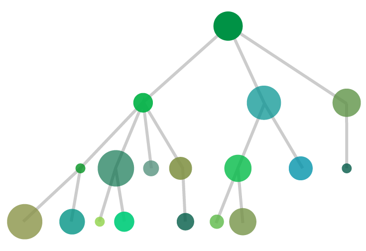

SCOOP (Scalable COncurrent Operations in Python) is a distributed task
module allowing concurrent parallel programming on various environments,
from heterogeneous grids to supercomputers.

Philosophy
----------

Our philosophy is based on these ideas:

    * The **future** is parallel;
    * **Simple** is beautiful;
    * **Parallelism** should be easy.
    
These tenets are translated concretely in a **minimum number of functions** 
allowing **maximum parallel efficiency** while keeping at **minimum the 
inner knowledge required** to use them. It is implemented in Python 3 in mind 
while being compatible with 2.6+ to allow fast prototyping without sacrificing 
efficiency and speed.

Features
--------

SCOOP features and advantages over 
`Futures <http://docs.python.org/dev/library/concurrent.futures.html>`_,
`multiprocessing <http://docs.python.org/dev/library/multiprocessing.html>`_ 
and similar modules are as follows:

    * Harness the power of **multiple computers** over network;
    * Ability to spawn subtasks within tasks;
    * API compatible with :pep:`3148`;
    * Parallelizing serial code with only minor modifications;
    * Efficient load-balancing.

Anatomy of a SCOOPed program
~~~~~~~~~~~~~~~~~~~~~~~~~~~~

SCOOP can handle multiple diversified multi-layered tasks. You can submit your different functions and data simultaneously and effortlessly while the framework executes them locally or remotely. Contrarly to most multiprocessing frameworks, it allows to launch subtasks within tasks.

Through SCOOP, you can simultaneously execute tasks that are of different 
nature (Discs of different colors) or different by complexity (Discs radiuses). The module will handle the physical considerations of parallelization, such as task distribution over your resources (load balancing), communications, etc.

Applications
~~~~~~~~~~~~

The common applications of SCOOP consist of, but is not limited to:

    * Evolutionary Algorithms
    * Monte Carlo simulations
    * Data mining
    * Data processing
    * Graph traversal

Manual
------

.. toctree::
   :maxdepth: 2
   
   install
   usage
   api
   
Indices and tables
==================

* :ref:`genindex`
* :ref:`modindex`
* :ref:`search`